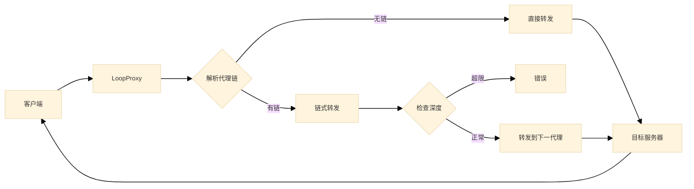

# LoopProxy

中文 | [English](README_EN.md)

<a name="README.md"></a>

## LoopProxy

LoopProxy 是一个轻量级、高性能的 HTTP 代理服务，支持链式代理转发，适用于复杂网络环境下的请求路由。

## 特性

- **链式代理**：支持多级代理链，灵活配置请求路径
- **超时控制**：可自定义请求超时时间，避免长时间阻塞
- **安全认证**：可选的哈希认证机制，保障服务安全
- **跨域支持**：内置 CORS 中间件，支持跨域请求
- **HTTP/2 支持**：基于 httpx 客户端，支持 HTTP/2 协议
- **健康检查**：提供 `/health` 端点监控服务状态

# LoopProxy - 链式代理服务

LoopProxy是一个允许请求通过一系列代理服务器链式传递的服务。

## 工作流程

以下流程图展示了LoopProxy如何处理代理请求：



## 环境变量配置

| 环境变量 | 描述 | 默认值 |
|----------|------|--------|
| `MAX_PROXY_DEPTH` | 最大代理链深度 | 5 |
| `REQUEST_TIMEOUT_MS` | 请求超时时间(毫秒) | 8000 |
| `HashAuth` | 哈希认证值 | 无 |

## 请求头说明

使用以下特殊请求头控制代理行为：

- `x-proxy-chain`: Base64 编码的 JSON 数组，包含代理链中的目标 URL
- `x-loop-count`: 当前请求的代理深度计数
- `x-target-url`: 最终目标 URL
- `HashAuth`: 与环境变量中配置的值匹配时允许访问

## 安装与部署

### 依赖

- Python 3.8+
- FastAPI
- Uvicorn
- httpx

### 安装步骤

```bash
# 克隆仓库
git clone https://github.com/yourusername/looproxy.git
cd looproxy

# 安装依赖
pip install -r requirements.txt

# 启动服务
python main.py
```

服务默认在 `http://localhost:8000` 上运行。

### Docker 部署

```bash
# 构建镜像
docker build -t looproxy .

# 运行容器
docker run -p 8000:8000 -e HashAuth=your_secret_hash looproxy
```

## 使用示例

### 基本代理请求

```bash
curl -X GET "http://localhost:8000/any-path" \
  -H "x-target-url: https://example.com/target-api" \
  -H "HashAuth: your_secret_hash"
```

### 链式代理请求

```bash
# 创建代理链 JSON 数组
PROXY_CHAIN='["https://proxy1.example.com", "https://proxy2.example.com"]'

# Base64 编码
ENCODED_CHAIN=$(echo -n $PROXY_CHAIN | base64)

# 发送请求
curl -X POST "http://localhost:8000/path" \
  -H "x-proxy-chain: $ENCODED_CHAIN" \
  -H "x-target-url: https://final-target.example.com/api" \
  -H "HashAuth: your_secret_hash" \
  -d '{"key": "value"}'
```

## 贡献指南

欢迎提交问题报告和拉取请求。请确保遵循以下步骤：

1. Fork 本仓库
2. 创建功能分支 (`git checkout -b feature/amazing-feature`)
3. 提交更改 (`git commit -m 'Add some amazing feature'`)
4. 推送到分支 (`git push origin feature/amazing-feature`)
5. 创建拉取请求

## 许可证

本项目采用 MIT 许可证 - 详情请参阅 [LICENSE](LICENSE) 文件。

## 性能优化

LoopProxy 采用了多项性能优化措施：

- 使用 `uvloop` 和 `httptools` (非 Windows 环境)
- HTTP/2 支持减少连接开销
- 连接池管理优化 (最大保持连接数：50，最大连接数：100)
- 请求超时控制防止资源耗尽

祝您使用愉快！
